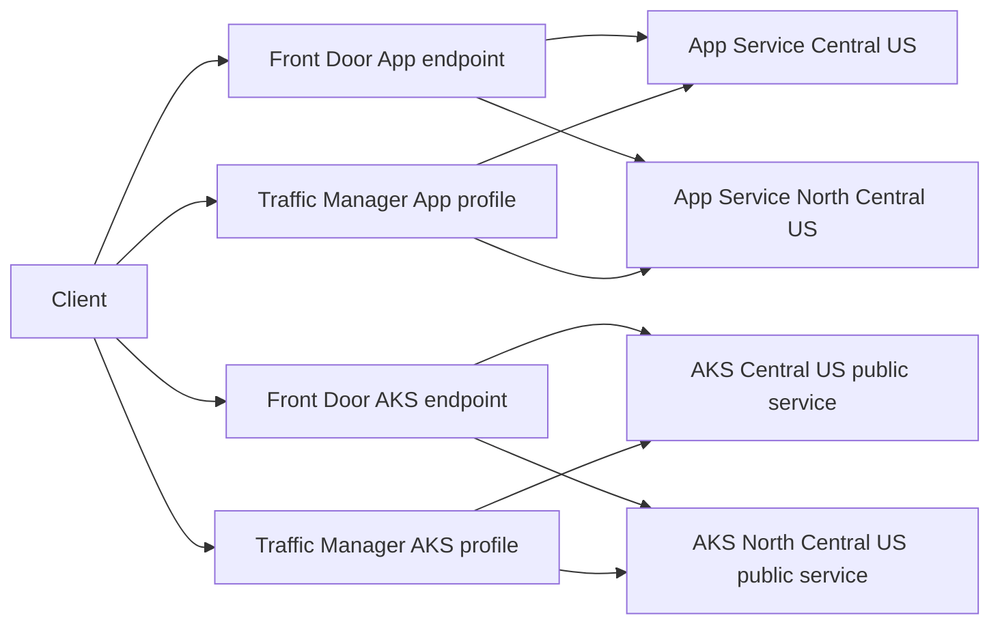

# Azure Front Door and Traffic Manager resiliency demo

This lab compares Azure Front Door and Azure Traffic Manager for regional failover of two independent HTTP workloads: App Service and AKS. The primary and secondary regions are configurable; the examples in this repository use Central US and North Central US.

Front Door is a Layer 7 proxy. It keeps a single `azurefd.net` endpoint while it selects a healthy origin. Traffic Manager is DNS-based. It returns a healthy priority endpoint, but failover observed by a client also depends on DNS TTL and cache behavior.

## Topology



Each Front Door workload has a separate endpoint and origin group. Each Traffic Manager workload has a separate Priority profile. Health probes use `/health`.

## Prerequisites

- Azure CLI with Bicep support
- PowerShell 7+
- `kubectl` when `DEPLOY_AKS=true`
- Owner or Contributor access to the target subscription; the AKS deployment creates an `AcrPull` role assignment

## Configuration

Copy `config/demo.env.example` to `config/demo.env` and set the values for your environment. `config/demo.env` is ignored by Git and must not contain credentials, tokens, or service-principal secrets.

```powershell
Copy-Item config/demo.env.example config/demo.env
```

For example, `AZURE_LOCATION_PRIMARY=centralus` and `AZURE_LOCATION_SECONDARY=northcentralus` represent the primary and secondary regions. Replace these values in `config/demo.env` with regions that meet your availability, capacity, pairing, and customer requirements. Use a short, lowercase, globally unique `DEMO_PREFIX`; it becomes part of public Front Door, Traffic Manager, Web App, AKS, and DNS-label names.

Before publishing a fork or pull request, run the local pre-publication check:

```powershell
./scripts/prepublish-check.ps1
```

Never commit `config/demo.env` or `outputs/demo-endpoints.env`. They are local-only and excluded by `.gitignore`. Tenant IDs, subscription IDs, resource-group names, public endpoint names, and credentials should be supplied through the local configuration or generated outputs, not committed to the public repository.

## Deploy

Sign in interactively, then run the script from the repository root:

```powershell
az login --tenant <your-tenant-id>
./scripts/deploy.ps1
```

The script creates the resource group if needed, deploys the App Service comparison, and, when `DEPLOY_AKS=true`, deploys two AKS clusters plus a temporary Basic ACR. It writes generated URLs to `outputs/demo-endpoints.env`, which is ignored by Git.

Deployment order is intentional: configuration and Azure context are validated first; the resource group and base resources are created next; App Service code is published; the ACR image is built; AKS kubelet identities receive `AcrPull`; the Kubernetes workload and public FQDNs are created; only then are the AKS Front Door and Traffic Manager resources deployed. The script stops at the first failed Azure CLI or `kubectl` command, so it does not continue against partially created resources.

The Front Door Bicep routes explicitly depend on their enabled origins. This prevents a route from being submitted before its origin group is ready. If a deployment is interrupted, inspect the failed deployment operations before rerunning; do not treat a partial resource group as a completed lab.

## Test

Verify direct origins first, then Front Door and Traffic Manager:

```powershell
Get-Content outputs/demo-endpoints.env
./scripts/test-frontdoor.ps1
./scripts/test-trafficmanager.ps1
```

The primary responses identify `Central US`. Use `Resolve-DnsName` output from the Traffic Manager script to discuss DNS selection. Recursive resolvers and browsers can continue using cached DNS results until TTL expiry.

### Browser walkthrough for Traffic Manager and App Service

This lab intentionally has no custom domain. Traffic Manager resolves to the selected Web App, but opening the generated `tm-app-<prefix>.trafficmanager.net` hostname directly can return App Service 404 because that hostname is not bound to the multi-tenant Web App. Use the native Web App hostname returned by DNS instead:

1. Run the DNS lookup using the generated Traffic Manager name:

  ```powershell
  Resolve-DnsName <TM_APP_FQDN> -Type CNAME
  ```

2. Copy the `NameHost` value, which is the selected Web App hostname, for example `<app-primary>.azurewebsites.net`.
3. Open that native hostname in a browser and confirm the response shows `Central US`.
4. Simulate App Service failover and wait for Traffic Manager health monitoring and DNS cache expiry:

  ```powershell
  ./scripts/failover-appservice.ps1 -Mode health
  Resolve-DnsName <TM_APP_FQDN> -Type CNAME
  ```

5. Open the new `NameHost` value, for example `<app-secondary>.azurewebsites.net`, and confirm the response shows `North Central US`.
6. Restore the primary before repeating the test:

  ```powershell
  ./scripts/restore-appservice.ps1
  ```

For AKS, the public service accepts the generated Traffic Manager hostname, so the browser can open `http://<TM_AKS_FQDN>` directly. A production Traffic Manager design for App Service requires a custom domain bound to both Web Apps and valid TLS certificates.

## Failover walkthrough

Run a baseline Front Door and Traffic Manager test, introduce one failure, wait for health-probe detection, then repeat the tests.

```powershell
# App Service: logical application failure (recommended)
./scripts/failover-appservice.ps1 -Mode health

# App Service: stop the primary Web App
./scripts/failover-appservice.ps1 -Mode stop

# AKS: stop only the public workload (recommended)
./scripts/failover-aks.ps1 -Mode workload

# AKS: stop the primary cluster; slower and optional
./scripts/failover-aks.ps1 -Mode cluster-stop
```

`health` changes the app's `HEALTHY` setting so `/health` returns HTTP 503. `stop` makes the entire primary Web App unavailable. `workload` scales the primary AKS deployment to zero replicas. All demonstrate that routing decisions are driven by health probes; they do not represent a complete regional outage.

Restore the respective primary workload after the test:

```powershell
./scripts/restore-appservice.ps1
./scripts/restore-aks.ps1
```

Front Door normally changes origin routing after its probe policy detects the failure. Traffic Manager must also detect the failure, then clients and recursive resolvers must refresh their DNS cache. The lab uses a 30-second Traffic Manager TTL, but it does not override intermediary cache behavior.

## Cleanup

```powershell
./scripts/cleanup.ps1 -Confirm
```

The script deletes the configured resource group, including Front Door, Traffic Manager, App Service, AKS, public IPs, and ACR.

## Manual portal deployment

See [docs/portal-deployment.md](docs/portal-deployment.md) for the equivalent manual Azure Portal flow. The guide uses Azure Cloud Shell to build the container image and apply the Kubernetes manifest.

## Production gaps

This is a public, low-cost demonstration and intentionally exposes the App Service and AKS origins. It does not configure WAF policy tuning, Private Link, direct-origin blocking, custom domains and certificate lifecycle, observability, CI/CD, data replication, RPO, or application-consistency procedures. Those elements are required for a production DR design.

For production, Front Door Standard/Premium with appropriate WAF and origin hardening is typically the global HTTP/HTTPS entry point. Traffic Manager remains useful for DNS-based failover, public endpoints, and certain hybrid scenarios.

## License

This project is released under the [MIT License](LICENSE). Azure trademarks, service names, and linked Microsoft documentation remain subject to their respective owners' terms.
